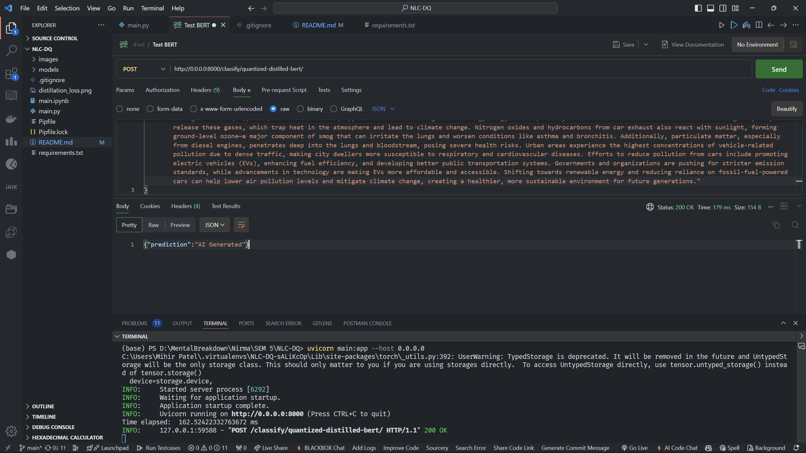

# Distillation and Quantization of BERT

## Table of Contents

- [About](#about)
- [Getting Started](#getting_started)
- [Usage](#usage)

## About

In this project we explored about distillation and quantization of various languae models. We finetuned BERT for AI content detection. Then this **"Finetuned"** underwent knowledege distillation to reduce the size and the inference time of the model. Even after distillation the models were observed to be heavy enough, so the need of quantization arose. Then we used dynamic quantization to further make our model memory efficient and faster. We converted the weights from fp32 to qint8, to achieve this.

## Getting Started

These are the instructions specifically related to th deployment of the model. These can be followed after the following models are placed in the models directory.

1. teacher_weights.pth
2. student_weights.pth
3. quantized_teacher_weights.pth
4. quantized_student_weights.pth

### Prerequisites

You need python installed on your system to run/deploy this project.

Check python version by running the following commands.

```
python --version
```

### Installing

A step by step series of examples that tell you how to get a development env running. Assuming that you have cloned this repo and are inside the repo folder.

Install pipenv

```
pip install pipenv
```

Create a virtual environment

```
pipenv shell
```

Activate the virtual environment, this will be done everytime

```
pipenv shell
```

Install requirements

```
pipenv run pip install -r requirements.txt
```

Install pytorch with gpu support

```
pipenv run pip install torch torchvision torchaudio --index-url https://download.pytorch.org/whl/cu118 
```

Deploying the models, with their API's

```
uvicorn main:app --host 0.0.0.0
```

End with an example of getting some data out of the system or using it for a little demo.

## Usage

Following the above steps will deploy this model locally, which can be confirmed by the following postman requests.


